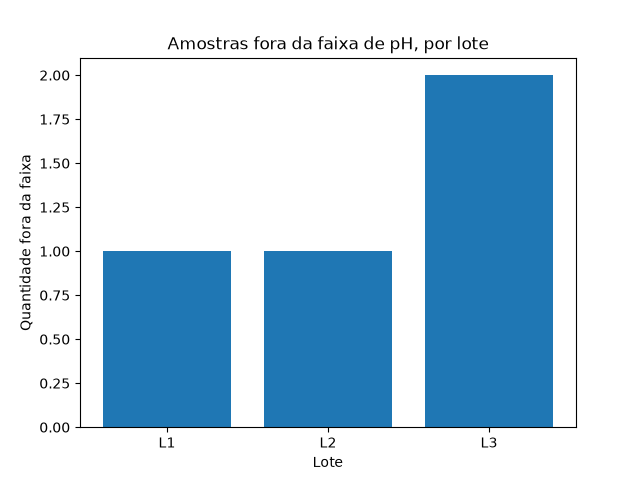

# Estudos de Python

Repositório de estudos de programação em Python, com foco em **análise de dados aplicada a química e materiais**.

Sou químico com pós-graduação em Engenharia de Materiais, em transição de carreira para a área de dados. Cada script abaixo resolve um problema típico de laboratório.

📖 [Glossário de referência](GLOSSARIO.md) — comandos de Python, pandas e Git explicados, com exemplos.

## Conteúdo

| Arquivo | Tema | Conceitos |
|---|---|---|
| `aula1.py` | Concentração molar e diluição | variáveis, operações, `print` |
| `aula2.py` | Cálculo interativo | `input()`, conversão com `float()` |
| `aula3.py` | Controle de qualidade de pH | listas, laço `for`, condicionais `if` |
| `aula4.py` | Tabelas de medições | pandas, DataFrame, filtros |
| `aula5.py` | Leitura de CSV e gráfico | `read_csv`, `groupby`, matplotlib |
| `revisao1.py` | Temperaturas de um forno | `sum`, `len`, contador, `max` |
| `aula6b.py` | Colunas calculadas e classificação | colunas com pandas, `.loc`, condições vetorizadas |
| `aula7_sql.py` | Consultas SQL sobre os dados | `sqlite3`, `SELECT`, `WHERE`, `GROUP BY` |

## Exemplo: controle de pH por amostra


## Como executar

Requer Python 3.10 ou superior.

```bash
pip install pandas
python aula4.py
```

## Conclusão: qual lote merece atenção?

O lote L3 foi o que mais apresentou amostras fora da faixa de pH (2 de 3), contra 1 de cada nos lotes L1 e L2. Esse problema não aparecia na média simples, porque o L3 tinha valores muito baixos e muito altos que se compensavam, resultando numa média (6,10) dentro da faixa aceitável (6,5–7,5). O caso mostra que uma média "normal" não garante que o processo esteja sob controle: é preciso olhar também a dispersão (mínimo e máximo) e a contagem de não conformidades antes de aprovar um lote.



## Próximos passos

- SQL: `ORDER BY`, `LIMIT`, `JOIN`
- Estatística inferencial (desvio padrão, testes de hipótese)
- Projeto com um conjunto de dados real de materiais
